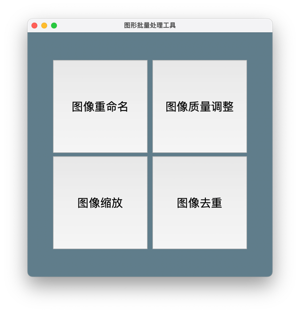

# img_transformer

一个利用PySide和OpenCv开发的带GUI的开源免费图像批量转换工具

---

## 目录

- [软件界面](#软件界面)
- [to_do_list](#to_do_list)
- [上手指南](#上手指南)
  - [开发前的配置要求](#开发前的配置要求)
  - [安装步骤](#安装步骤)
- [文件目录说明](#文件目录说明)
- [部署](#部署)
- [使用到的框架](#使用到的框架)
- [版本控制](#版本控制)
- [作者](#作者)

---
### 软件界面

1. 主界面

2. 图像重命名

3. 图像质量调整

4. 图像缩放

5. 图像去重


### to_do_list
- [x] 主UI创建
- [x] 图像重命名
- [x] 图像质量调整
- [x] 图像缩放
- [x] 图像去重
- [ ] 适配Windows UI
- [ ] 图像二值化
- [ ] ...

更多需求请写在issues或[联系我](#作者)
### 上手指南
1. 下载对应系统的可执行文件，打开即可运行，无需配置环境
2. 需要二次开发可手动配置环境并运行py文件，请参考[部署](#部署)

###### 开发前的配置要求

1. python >= 3.6
2. windows >= 7
3. macos >= 10
4. 未在linux下打包，请自行配置环境运行
###### **安装步骤**

1. 下载对应发行版
2. 解压后找到可运行文件打开即可使用
3. 如果您是linux或希望自配环境运行，请参考[部署](#部署)
### 文件目录说明

```
img_transformer
├── README.md
├── img_transformer.py                    # 主函数入口文件
├── logic_code                            # 逻辑文件
│   ├── img_binarization.py
│   ├── ...
├── qss                                   # 风格文件（暂时没有适配）
│   ├── mac.qss
│   ├── py_dracula_dark.qss
│   └── py_dracula_light.qss
├── requirement.txt                       # python外部库环境要求
├── ui_code                               # ui文件
│   ├── ui_img_dup.py
│   ├── ...
└── ui_file                               # ui源文件（可用QtDesigner打开）
    ├── img_dup.ui
    ├── ...
```

### 部署

1. 使用conda创建新的虚拟环境
```
conda create -n img_transformer python=3.9
```
2. 安装外部库
```
conda activate img_transformer
pip install opencv-python pyside6
```
3. 运行
```
cd path/to/ima_transformer
python img_transformer.py
```
4. 若想自行打包可执行文件可参考nuitka或pyinstaller
### 使用到的框架

- [PySide6](https://pypi.org/project/PySide6/)

### 版本控制

该项目使用Git进行版本管理。

### 作者

mail：724818342@qq.com

qq:724818342

wx：15670886235

### 版权说明

该项目签署了MIT 授权许可，详情请参阅 [LICENSE.txt](https://github.com/shaojintian/Best_README_template/blob/master/LICENSE.txt)

### 鸣谢

- [PySide6](https://doc.qt.io/qtforpython/PySide6/QtWidgets/index.html)


